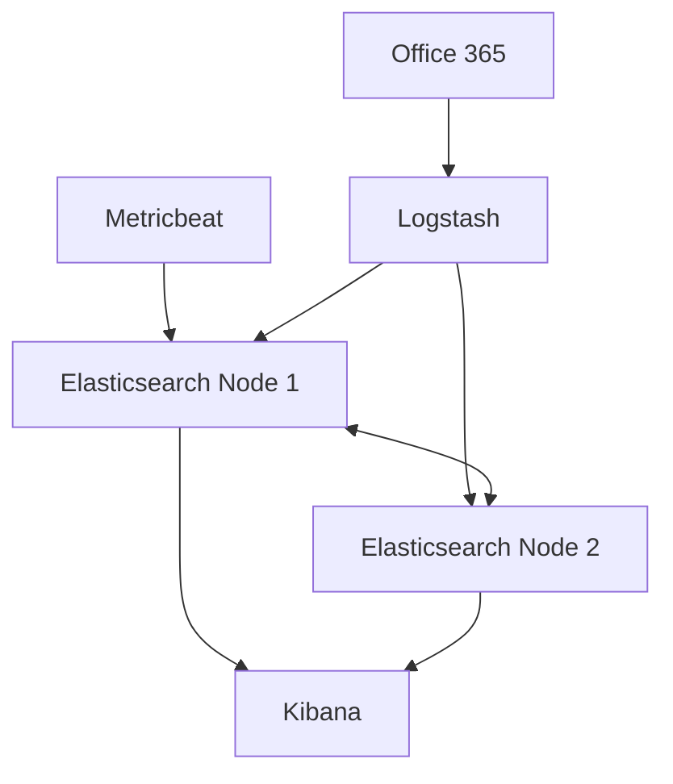
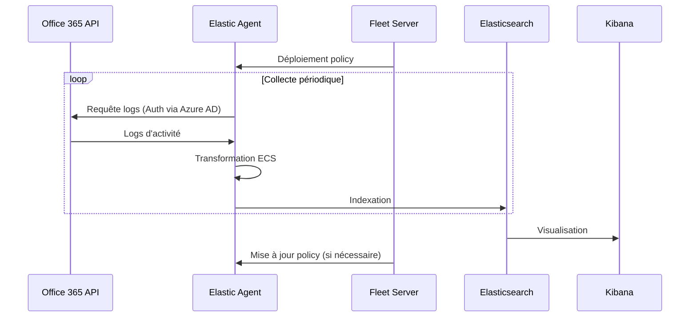

# Documentation d'Architecture ELK

## Table des Matières

- [Introduction](#introduction)
- [Structure du Dossier](#structure-du-dossier)
- [Flux d'Ingestion Office 365](#flux-dingestion-office-365)
- [Diagrammes d'Infrastructure](#diagrammes-dinfrastructure)
- [Détails de Déploiement](#détails-de-déploiement)
- [Backup & Résilience](#backup--résilience)
- [Mise à Jour & Contributions](#mise-à-jour--contributions)

## Introduction

Ce dossier `architecture/` contient toute la documentation technique relative à l'architecture de notre stack ELK (Elasticsearch, Logstash, Kibana). Il sert de référence principale pour comprendre l'organisation, le déploiement et la maintenance de notre infrastructure de logging.

### Contexte Technique

- **Base de déploiement** : Repository [deviantony/docker-elk](https://github.com/deviantony/docker-elk)
- **Version Elastic** : 9.0.2
- **Infrastructure** :
  - Cluster Elasticsearch à 2 nœuds (elasticsearch et elasticsearch02) sur une même VM
  - Conteneurs Docker orchestrés via docker-compose
  - Fleet Server pour la gestion des agents Elastic
- **Monitoring** : Metricbeat pour la collecte des métriques
- **Sources de données** : 9 intégrations Office 365 gérées via Fleet Server
- **Gestion des agents** : Fleet Server pour le déploiement et la mise à jour des policies

## Structure du Dossier

```
architecture/
├── ARCHITECTURE.md             # Ce document
├── infrastructure_diagrams/    # Diagrammes techniques (.drawio, .mmd)
├── component_descriptions/     # Documentation détaillée des composants
├── deployment_details/         # Configuration et déploiement
└── backup_and_resiliency.md   # Stratégies de backup et résilience
```

### Description des Éléments

- **infrastructure_diagrams/** : Contient les diagrammes d'architecture au format Draw.io (.drawio) et Mermaid (.mmd), illustrant les flux de données et l'organisation du cluster
- **component_descriptions/** : Documentation détaillée de chaque composant, incluant les configurations spécifiques et les bonnes pratiques
- **deployment_details/** : Fichiers de configuration Docker et Elastic, procédures de déploiement
- **backup_and_resiliency.md** : Documentation complète des stratégies de backup et de résilience

## Diagrammes d'Infrastructure

### Organisation des Diagrammes

- **Format Draw.io** : Utilisé pour les schémas complexes et détaillés
- **Format Mermaid** : Pour les diagrammes de flux et les représentations simples
- **Export PNG** : Versions statiques pour consultation rapide

### Architecture Générale



## Descriptions des Composants

### Elasticsearch

- **Configuration Cluster** :
  - 2 nœuds (elasticsearch: master+data, elasticsearch02: data)
  - Heap size: 2GB par nœud
  - Discovery type: single-node (VM unique)

### Logstash

- **Pipelines Office 365** :
  - Mapping ECS (Elastic Common Schema)

### Kibana

- **Organisation** :
  - Dashboards standardisés

## Détails de Déploiement

### Configuration Docker

Extrait du `docker-compose.yml` pour les services additionnels :

```yaml
  elasticsearch2:
    build:
      context: elasticsearch/
      args:
        ELASTIC_VERSION: 9.0.2
    volumes:
      - ./elasticsearch/config/elasticsearch2.yml:/usr/share/elasticsearch/config/elasticsearch.yml
      - elasticsearch2:/usr/share/elasticsearch/data
    environment:
      ES_JAVA_OPTS: "-Xmx4g -Xms4g"
      ELASTIC_PASSWORD: ${ELASTIC_PASSWORD}
      discovery.type: single-node

  fleet-server:
    build:
      context: fleet-server/
      args:
        ELASTIC_VERSION: 9.0.2
    volumes:
      - ./fleet-server/config/fleet-server.yml:/usr/share/fleet-server/fleet-server.yml
    environment:
      FLEET_SERVER_ENABLE: "1"
      FLEET_SERVER_ELASTICSEARCH_HOST: http://elasticsearch:9200
      FLEET_SERVER_SERVICE_TOKEN: ${FLEET_TOKEN}
    ports:
      - "8220:8220"
    depends_on:
      - elasticsearch

  metricbeat:
    build:
      context: metricbeat/
      args:
        ELASTIC_VERSION: 9.0.2
    user: root
    volumes:
      - ./metricbeat/config/metricbeat.yml:/usr/share/metricbeat/metricbeat.yml
      - /var/run/docker.sock:/var/run/docker.sock:ro
    depends_on:
      - elasticsearch
```

## Backup & Résilience

### Stratégie de Snapshots

- #todo : Ajouter la configuration des snapshots Elasticsearch

### Résilience des Conteneurs

- Monitoring via Metricbeat

## Mise à Jour & Contributions

### Processus de Mise à Jour

1. **Mise à jour de l'intégration O365**
   
   - Vérifier les nouvelles versions dans Kibana > Integrations
   - Tester l'upgrade sur un agent de test
   - Déployer via Fleet Server sur les autres agents

2. **Mise à jour de la documentation**
   
   - Modifier les diagrammes Draw.io dans `infrastructure_diagrams/`
   - Mettre à jour la documentation associée
   - Valider les changements avec l'équipe

3. **Procédure de validation**
   
   - Tests des nouvelles policies O365
   - Vérification des flux de données
   - Validation des dashboards Kibana

## Flux d'Ingestion Office 365

### Principe de Fonctionnement

L'intégration Office 365 est basée sur l'utilisation de l'Office 365 Management Activity API via le package O365 standard d'Elastic. Cette configuration est entièrement gérée par Fleet Server.

### Configuration Azure AD

1. **Enregistrement de l'Application**
   
   - Récupération des identifiants nécessaires :
     - `Tenant ID` : Identifiant du tenant Azure AD
     - `Client ID` : ID de l'application enregistrée
     - `Client Secret` : Secret généré pour l'authentification

2. **Permissions Requises**
   
   - `ActivityFeed.Read` : Lecture des logs d'activité
   - `ActivityFeed.ReadDlp` : Accès aux événements DLP
   - Consentement administrateur requis pour ces permissions

### Configuration dans Elastic

1. **Configuration dans Kibana**
   
   ```yaml
   # Integration > Microsoft Office 365
   - Name: O365 Integration
   - CEL Input: Enabled
   - Collection Method: Management Activity API
   ```

2. **Rôle du Fleet Server**
   
   - Déploiement automatisé des policies aux agents
   - Gestion centralisée des mises à jour
   - Supervision de l'état des agents

3. **Comportement des Elastic Agents**
   
   - Collecte périodique des logs d'activité
   - Déduplication native des événements
   - Transformation au format ECS (Elastic Common Schema)
   - Envoi direct vers Elasticsearch

### Flux de Données


