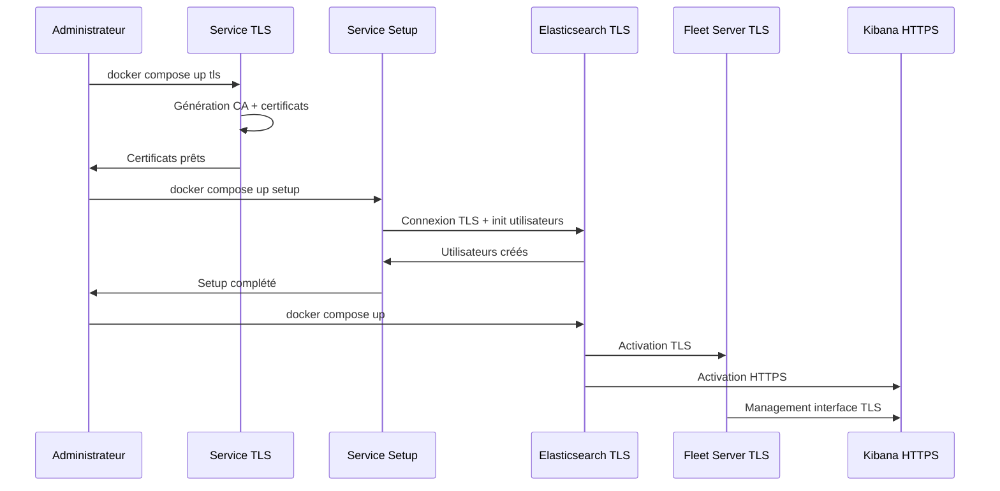
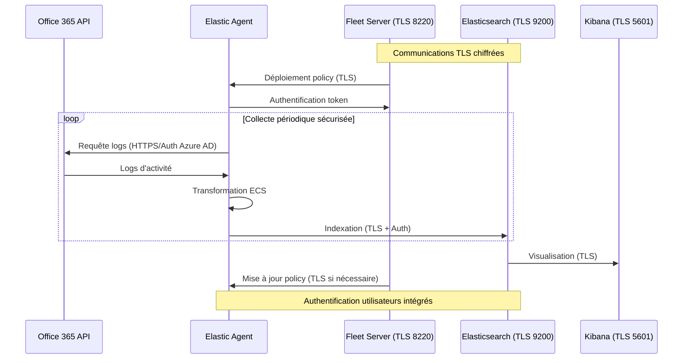

# Documentation d'Architecture ELK

## Table des Matières

- [Introduction](#introduction)
- [Structure du Dossier](#structure-du-dossier)
- [Flux d'Ingestion Office 365](#flux-dingestion-office-365)
- [Diagrammes d'Infrastructure](#diagrammes-dinfrastructure)
- [Détails de Déploiement](#détails-de-déploiement)
- [Backup & Résilience](#backup--résilience)
- [Mise à Jour & Contributions](#mise-à-jour--contributions)

## Introduction

Ce dossier `architecture/` contient toute la documentation technique relative à l'architecture de notre stack ELK (Elasticsearch, Logstash, Kibana). Il sert de référence principale pour comprendre l'organisation, le déploiement et la maintenance de notre infrastructure de logging.

### Contexte Technique

- **Base de déploiement** : Repository [deviantony/docker-elk](https://github.com/deviantony/docker-elk) (branche TLS)
- **Version Elastic** : 9.0.2
- **Sécurité** : Communications TLS complètes entre tous les composants
- **Architecture TLS** :
  - Certificats X.509 auto-générés pour tous les services
  - Autorité de certification (CA) dédiée
  - Chiffrement complet des communications inter-services
  - Authentification mutuelle entre composants
- **Infrastructure** :
  - Cluster Elasticsearch à 2 nœuds avec TLS transport (ports 9200/9300)
  - Conteneurs Docker orchestrés via docker-compose avec certificats partagés
  - Fleet Server sécurisé pour la gestion des agents (port 8220 TLS)
  - Volume Docker persistent pour certificats (`certs` volume)
- **Monitoring** : Metricbeat avec connexions TLS sécurisées
- **Sources de données** : 9 intégrations Office 365 gérées via Fleet Server avec authentification Azure AD
- **Gestion des agents** : Fleet Server pour déploiement sécurisé des policies et agents
- **Authentification** : Utilisateurs intégrés Elastic (elastic, kibana_system, logstash_internal) avec rotation des mots de passe
- **Déploiement sécurisé** : Processus en 3 étapes (TLS → Setup → Stack) pour initialisation complète

## Structure du Dossier

```
architecture/
├── ARCHITECTURE.md             # Ce document
├── infrastructure_diagrams/    # Diagrammes techniques (.drawio, .mmd)
├── component_descriptions/     # Documentation détaillée des composants
├── deployment_details/         # Configuration et déploiement
└── backup_and_resiliency.md   # Stratégies de backup et résilience
```

### Description des Éléments

- **infrastructure_diagrams/** : Contient les diagrammes d'architecture au format Draw.io (.drawio) et Mermaid (.mmd), illustrant les flux de données et l'organisation du cluster
- **component_descriptions/** : Documentation détaillée de chaque composant, incluant les configurations spécifiques et les bonnes pratiques
- **deployment_details/** : Fichiers de configuration Docker et Elastic, procédures de déploiement
- **backup_and_resiliency.md** : Documentation complète des stratégies de backup et de résilience

## Diagrammes d'Infrastructure

### Organisation des Diagrammes

- **Format Mermaid** : Diagrammes de flux et architecture sécurisée TLS
- **data_flow_mermaid.mmd** : Architecture complète avec flux de données TLS
- **tls_certificates_architecture.mmd** : Détail de l'infrastructure des certificats
- **Export PNG** : Versions statiques pour consultation rapide

### Architecture Sécurisée TLS Complète

Le diagramme principal ([data_flow_mermaid.mmd](infrastructure_diagrams/data_flow_mermaid.mmd)) illustre :

- **Communications chiffrées** entre tous les composants
- **Ports TLS** spécifiques à chaque service
- **Flux d'authentification** Azure AD et certificats
- **Gestion centralisée** via Fleet Server sécurisé

### Architecture des Certificats TLS

Le diagramme des certificats ([tls_certificates_architecture.mmd](infrastructure_diagrams/tls_certificates_architecture.mmd)) détaille :

- **Autorité de Certification (CA)** auto-générée
- **Distribution des certificats** via volume Docker
- **Processus de génération** docker-elk TLS
- **Commandes de maintenance** et re-génération

### Processus de Déploiement Sécurisé



## Descriptions des Composants

### Services d'Infrastructure TLS

#### Service TLS (docker-elk spécifique)

- **Génération certificats** : CA racine + certificats pour chaque service
- **Volume persistant** : Stockage sécurisé des clés et certificats
- **Commande** : `docker compose up tls` pour génération/re-génération
- **Fichier instances.yml** : Configuration DNS/IP pour certificats
- Documentation : [tls-service.md](component_descriptions/tls-service.md)

#### Service Setup (docker-elk spécifique)

- **Initialisation utilisateurs** : elastic, kibana_system, logstash_internal, beats_system
- **Configuration TLS** : Validation connexions sécurisées Elasticsearch
- **Commande** : `docker compose up setup` après génération TLS
- **Variables .env** : Configuration mots de passe initiaux
- Documentation : [setup-service.md](component_descriptions/setup-service.md)

### Elasticsearch (TLS Enabled)

- **Configuration Cluster TLS** :
  - 2 nœuds avec communication transport chiffrée (port 9300)
  - API HTTPS sur port 9200 avec certificats X.509
  - Heap size: 2GB par nœud (configurable via ES_JAVA_OPTS)
  - **Sécurité** : X-Pack Security activé avec RBAC complet
  - **Certificats** : elasticsearch.crt/key + validation CA
- Documentation : [elasticsearch.md](component_descriptions/elasticsearch.md)

### Logstash (TLS Outputs)

- **Pipelines Sécurisés** :
  - Connexions TLS vers Elasticsearch (authentification logstash_internal)
  - Mapping ECS avec validation certificats CA
  - **Ports** : 5044 (Beats TLS), 50000 (TCP), 9600 (monitoring API)
  - **Configuration** : SSL/TLS pour tous les outputs Elasticsearch
- Documentation : [logstash.md](component_descriptions/logstash.md)

### Kibana (HTTPS Interface)

- **Interface Web Sécurisée** :
  - HTTPS sur port 5601 avec certificat kibana.crt/key
  - Authentification intégrée utilisateurs Elasticsearch
  - **Fleet Management** : Interface TLS pour gestion agents
  - **Session sécurisée** : Cookies HTTPS et timeout configurables
- Documentation : [kibana.md](component_descriptions/kibana.md)

### Fleet Server (TLS Management)

- **Gestion Agents Sécurisée** :
  - Communications TLS sur port 8220 (fleet-server.crt/key)
  - Enrôlement agents avec token + validation CA
  - **Policies** : Déploiement sécurisé des configurations O365
  - **Monitoring** : Surveillance agents avec authentification mutuelle
- Documentation : [fleet.md](component_descriptions/fleet.md)

### Metricbeat (TLS Monitoring)

- **Surveillance Infrastructure** :
  - Connexions TLS vers Elasticsearch (utilisateur beats_system)
  - Métriques Docker avec validation certificats
  - **Modules** : Docker, System, Elasticsearch avec TLS
- Documentation : [metricbeat.md](component_descriptions/metricbeat.md)

## Détails de Déploiement

### Processus de Déploiement docker-elk TLS

Le déploiement suit un processus en 3 étapes spécifique au projet docker-elk avec TLS :

```bash
# 1. Génération des certificats TLS
git clone --branch tls https://github.com/deviantony/docker-elk.git
cd docker-elk
docker compose up tls

# 2. Initialisation des utilisateurs Elasticsearch
docker compose up setup

# 3. Démarrage de tous les services
docker compose up -d
```

### Configuration Docker-Compose TLS

#### Service TLS (Génération Certificats)

```yaml
tls:
  image: elasticsearch:9.0.2
  command: >
    bash -c '
      if [[ ! -f config/certs/ca.zip ]]; then
        echo "Creating CA";
        bin/elasticsearch-certutil ca --silent --pem -out config/certs/ca.zip;
        unzip config/certs/ca.zip -d config/certs;
      fi;
      if [[ ! -f config/certs/certs.zip ]]; then
        echo "Creating certs";
        bin/elasticsearch-certutil cert --silent --pem -out config/certs/certs.zip \
          --in config/certs/instances.yml \
          --ca-cert config/certs/ca/ca.crt \
          --ca-key config/certs/ca/ca.key;
        unzip config/certs/certs.zip -d config/certs;
      fi;
      chown -R root:root config/certs;
      find . -type d -exec chmod 755 \{\} \;;
      find . -type f -exec chmod 644 \{\} \;;
      tail -f /dev/null;
    '
  volumes:
    - certs:/usr/share/elasticsearch/config/certs
```

#### Service Setup (Initialisation Utilisateurs)

```yaml
setup:
  image: elasticsearch:9.0.2
  command: >
    bash -c '
      # Initialisation utilisateurs avec TLS
      until curl -s --cacert config/certs/ca/ca.crt https://elasticsearch:9200 | grep -q "missing authentication credentials"; do sleep 30; done;
      echo "Setting kibana_system password";
      until curl -s -X POST --cacert config/certs/ca/ca.crt -u "elastic:${ELASTIC_PASSWORD}" \
        -H "Content-Type: application/json" https://elasticsearch:9200/_security/user/kibana_system/_password \
        -d "{\"password\":\"${KIBANA_SYSTEM_PASSWORD}\"}" | grep -q "^{}"; do sleep 10; done;
      # ... autres utilisateurs
    '
  depends_on:
    - elasticsearch
```

#### Elasticsearch avec Configuration TLS

```yaml
elasticsearch:
  build:
    context: elasticsearch/
    args:
      ELASTIC_VERSION: 9.0.2
  volumes:
    - ./elasticsearch/config/elasticsearch.yml:/usr/share/elasticsearch/config/elasticsearch.yml
    - elasticsearch:/usr/share/elasticsearch/data
    - certs:/usr/share/elasticsearch/config/certs
  environment:
    ES_JAVA_OPTS: "-Xmx2g -Xms2g"
    ELASTIC_PASSWORD: ${ELASTIC_PASSWORD}
    xpack.license.self_generated.type: trial
    xpack.security.enabled: true
    xpack.security.http.ssl.enabled: true
    xpack.security.http.ssl.key: certs/elasticsearch/elasticsearch.key
    xpack.security.http.ssl.certificate: certs/elasticsearch/elasticsearch.crt
    xpack.security.http.ssl.certificate_authorities: certs/ca/ca.crt
    xpack.security.transport.ssl.enabled: true
    xpack.security.transport.ssl.key: certs/elasticsearch/elasticsearch.key
    xpack.security.transport.ssl.certificate: certs/elasticsearch/elasticsearch.crt
    xpack.security.transport.ssl.certificate_authorities: certs/ca/ca.crt
  ports:
    - "9200:9200"
    - "9300:9300"
  depends_on:
    - tls

  fleet-server:
    build:
      context: fleet-server/
      args:
        ELASTIC_VERSION: 9.0.2
    volumes:
      - ./fleet-server/config/fleet-server.yml:/usr/share/fleet-server/fleet-server.yml
      - certs:/usr/share/fleet-server/config/certs
    environment:
      FLEET_SERVER_ENABLE: "1"
      FLEET_SERVER_ELASTICSEARCH_HOST: https://elasticsearch:9200
      FLEET_SERVER_ELASTICSEARCH_CA: /usr/share/fleet-server/config/certs/ca/ca.crt
      FLEET_SERVER_SERVICE_TOKEN: ${FLEET_TOKEN}
      FLEET_SERVER_CERT: /usr/share/fleet-server/config/certs/fleet-server/fleet-server.crt
      FLEET_SERVER_CERT_KEY: /usr/share/fleet-server/config/certs/fleet-server/fleet-server.key
    ports:
      - "8220:8220"
```

### Variables d'Environnement (.env)

```env
# Configuration TLS et authentification
ELASTIC_PASSWORD=changeme
KIBANA_SYSTEM_PASSWORD=changeme
LOGSTASH_INTERNAL_PASSWORD=changeme
BEATS_SYSTEM_PASSWORD=changeme
FLEET_TOKEN=your-fleet-server-token

# Configuration Elasticsearch
ES_JAVA_OPTS=-Xmx2g -Xms2g
ELASTIC_VERSION=9.0.2

# Licence et sécurité
XPACK_LICENSE_SELF_GENERATED_TYPE=trial
XPACK_SECURITY_ENABLED=true
```

## Backup & Résilience

### Stratégie TLS et Certificats

#### Sauvegarde des Certificats

```bash
# Backup volume certificats
docker run --rm -v docker-elk_certs:/certs -v $(pwd):/backup alpine \
  tar czf /backup/certificates-backup-$(date +%Y%m%d).tar.gz -C /certs .

# Restauration certificats
docker run --rm -v docker-elk_certs:/certs -v $(pwd):/backup alpine \
  tar xzf /backup/certificates-backup-YYYYMMDD.tar.gz -C /certs
```

#### Rotation des Certificats

- **Fréquence recommandée** : Tous les 6 mois
- **Procédure d'urgence** : Re-génération en cas de compromission
- **Commandes** :

```bash
# Nettoyage certificats existants
find tls/certs -name ca -prune -or -type d -mindepth 1 -exec rm -rfv {} +

# Re-génération complète
docker compose up tls
docker compose restart elasticsearch kibana fleet-server logstash
```

### Snapshots avec Authentification TLS

#### Configuration Repository

```bash
# Création repository avec authentification TLS
curl -X PUT "https://localhost:9200/_snapshot/backup_repository" \
  --cacert tls/certs/ca/ca.crt \
  -u elastic:${ELASTIC_PASSWORD} \
  -H 'Content-Type: application/json' \
  -d '{
    "type": "fs",
    "settings": {
      "location": "/mount/backups/elasticsearch_snapshots"
    }
  }'
```

#### Snapshot Automatisé

```bash
# Création snapshot avec TLS
curl -X PUT "https://localhost:9200/_snapshot/backup_repository/snapshot_$(date +%Y%m%d)" \
  --cacert tls/certs/ca/ca.crt \
  -u elastic:${ELASTIC_PASSWORD} \
  -H 'Content-Type: application/json' \
  -d '{
    "indices": "o365-*,metricbeat-*",
    "ignore_unavailable": true,
    "include_global_state": false
  }'
```

### Monitoring et Surveillance

#### Health Check TLS

```bash
# Vérification santé cluster avec TLS
curl -X GET "https://localhost:9200/_cluster/health?pretty" \
  --cacert tls/certs/ca/ca.crt \
  -u elastic:${ELASTIC_PASSWORD}

# Vérification certificats
openssl x509 -in tls/certs/elasticsearch/elasticsearch.crt -dates -noout
```

#### Surveillance Expiration Certificats

- **Script de monitoring** : Alerte 30 jours avant expiration
- **Métrique Metricbeat** : Intégration surveillance certificats
- **Dashboard Kibana** : Vue centralisée santé TLS

## Mise à Jour & Contributions

### Processus de Mise à Jour docker-elk TLS

#### Mise à Jour Version ELK

```bash
# 1. Sauvegarde certificats et données
docker compose exec elasticsearch bin/elasticsearch-snapshot-repository create backup_repo
docker run --rm -v docker-elk_certs:/certs -v $(pwd):/backup alpine \
  tar czf /backup/certs-$(date +%Y%m%d).tar.gz -C /certs .

# 2. Mise à jour .env
ELASTIC_VERSION=9.x.x

# 3. Re-build et redémarrage
docker compose build
docker compose down
docker compose up tls  # Re-génération certificats si nécessaire
docker compose up setup
docker compose up -d
```

#### Mise à Jour Intégrations O365

1. **Via Interface Kibana (Recommandé)**
   - Fleet > Integrations > Office 365 > Upgrade
   - Test sur agent de développement
   - Déploiement progressif via policies

2. **Mise à Jour Documentation**
   - Diagrammes Mermaid : `infrastructure_diagrams/*.mmd`
   - Documentation composants : `component_descriptions/*.md`
   - Validation architecture TLS après changements

### Validation Post-Mise à Jour

#### Tests de Connectivité TLS

```bash
# Test Elasticsearch HTTPS
curl -X GET "https://localhost:9200/_cluster/health?pretty" \
  --cacert tls/certs/ca/ca.crt -u elastic:${ELASTIC_PASSWORD}

# Test Kibana HTTPS
curl -X GET "https://localhost:5601/api/status" \
  --cacert tls/certs/ca/ca.crt -u elastic:${ELASTIC_PASSWORD}

# Test Fleet Server TLS
curl -X GET "https://localhost:8220/api/status" \
  --cacert tls/certs/ca/ca.crt
```

#### Validation Flux Données O365

- Vérification ingestion logs Office 365
- Test dashboards et visualisations
- Validation alertes et détections

### Standards de Contribution

#### Documentation Architecture

- **Diagrammes** : Format Mermaid pour compatibilité Git
- **Descriptions** : Documentation minimale mais complète par composant
- **TLS First** : Toujours documenter les aspects sécurité/certificats

#### Nomenclature

- **Fichiers** : `snake_case.md` pour documentation
- **Diagrammes** : `component_description_type.mmd`
- **IDs Mermaid** : Unique et descriptif (ex: `tls-certs-architecture`)

---

## Récapitulatif Architecture docker-elk TLS

### Points Clés de Sécurité

✅ **Communications chiffrées** : TLS obligatoire sur tous les ports (9200, 9300, 5601, 8220)  
✅ **Authentification forte** : Utilisateurs dédiés avec rotation des mots de passe  
✅ **Certificats managés** : CA auto-générée avec renouvellement documenté  
✅ **Volume persistant** : Préservation des certificats entre redémarrages  
✅ **Monitoring sécurisé** : Metricbeat avec authentification TLS  

### Commandes Essentielles

```bash
# Déploiement initial complet
git clone --branch tls https://github.com/deviantony/docker-elk.git
cd docker-elk
docker compose up tls && docker compose up setup && docker compose up -d

# Maintenance certificats
find tls/certs -name ca -prune -or -type d -mindepth 1 -exec rm -rfv {} +
docker compose up tls

# Monitoring santé TLS
curl --cacert tls/certs/ca/ca.crt -u elastic:password https://localhost:9200/_cluster/health
```

### Architecture Validée

Cette documentation reflète une architecture **docker-elk TLS production-ready** avec :
- Sécurité transport end-to-end
- Gestion automatisée des certificats  
- Authentification centralisée
- Monitoring et backup sécurisés
- Procédures de maintenance documentées
   - Vérification des flux de données
   - Validation des dashboards Kibana

## Flux d'Ingestion Office 365

### Principe de Fonctionnement

L'intégration Office 365 est basée sur l'utilisation de l'Office 365 Management Activity API via le package O365 standard d'Elastic. Cette configuration est entièrement gérée par Fleet Server.

### Architecture d'Enrichissement des Données


L'architecture d'enrichissement des données O365 combine plusieurs composants pour fournir une analyse sécurisée avec validation géographique :

#### 1. Sources de Données
- **Office 365 Management API** : Collecte en temps réel des événements d'audit et d'activité
- **CSV Whitelists** : Listes blanches des pays autorisés (utilisateurs et tenants)

#### 2. Couche de Collecte
- **Elastic Agent** : Intégration O365 native avec transformation ECS
- **Logstash** : Pipelines dédiés pour l'analyse des fichiers CSV

#### 3. Enrichissement à l'Ingestion
- **Enrich Policies** : Politiques de lookup pour validation géographique
- **Ingest Pipeline** : Enrichissement automatique avec flags `user.whitelisted` et `tenant.whitelisted`

#### 4. Avantages de cette Architecture
- **Performance** : Enrichissement à l'ingestion (pas de jointures coûteuses)
- **Sécurité** : Validation immédiate des connexions géographiques
- **Scalabilité** : Traitement distribué et cache des lookups
- **Maintenance** : Mise à jour des listes blanches via CSV simples

### Configuration Azure AD

1. **Enregistrement de l'Application**
   
   - Récupération des identifiants nécessaires :
     - `Tenant ID` : Identifiant du tenant Azure AD
     - `Client ID` : ID de l'application enregistrée
     - `Client Secret` : Secret généré pour l'authentification

2. **Permissions Requises**
   
   - `ActivityFeed.Read` : Lecture des logs d'activité
   - `ActivityFeed.ReadDlp` : Accès aux événements DLP
   - Consentement administrateur requis pour ces permissions

### Configuration dans Elastic

1. **Configuration dans Kibana**
   
   ```yaml
   # Integration > Microsoft Office 365
   - Name: O365 Integration
   - CEL Input: Enabled
   - Collection Method: Management Activity API
   ```

2. **Rôle du Fleet Server**
   
   - Déploiement automatisé des policies aux agents
   - Gestion centralisée des mises à jour
   - Supervision de l'état des agents

3. **Comportement des Elastic Agents**
   
   - Collecte périodique des logs d'activité
   - Déduplication native des événements
   - Transformation au format ECS (Elastic Common Schema)
   - Envoi direct vers Elasticsearch

### Flux de Données avec TLS


