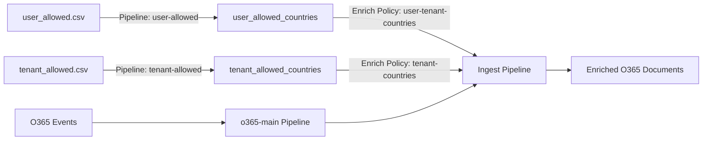

# Architecture Finale - Index Séparés O365 Geo-Enrichissement

## 🏗️ Structure des Index

### Index 1: `tenant_allowed_countries`

**Objectif** : Listes blanches au niveau tenant (politique générale)

```json
{
  "_id": "contoso",
  "_source": {
    "tenant": {
      "id": "contoso"
    },
    "allowed": ["US", "GB", "DE", "FR", "ES"],
    "countries_count": 5,
    "@timestamp": "2024-01-15T10:30:00.000Z"
  }
}
```

**Utilisation** :
- Politique d'enrichissement : `tenant-countries`
- Match field : `tenant.id`
- Pipeline source : `tenant-allowed`

### Index 2: `user_allowed_countries`

**Objectif** : Listes blanches granulaires par utilisateur-tenant

```json
{
  "_id": "contoso|alice@contoso.com",
  "_source": {
    "tenant_user": "contoso|alice@contoso.com",
    "tenant": {
      "id": "contoso"
    },
    "user": {
      "name": "alice@contoso.com"
    },
    "allowed": ["US", "GB"],
    "@timestamp": "2024-01-15T10:30:00.000Z"
  }
}
```

**Utilisation** :
- Politique d'enrichissement : `user-tenant-countries`
- Match field : `tenant_user`
- Pipeline source : `user-allowed`

## 🔄 Flux de Données Corrigé



## ⚙️ Configuration Logstash

### Pipeline `user-allowed`

```ruby
# Produit des documents avec clé: tenant_user = "contoso|alice@contoso.com"
output {
  elasticsearch {
    index => "user_allowed_countries"
    document_id => "%{tenant_user}"  # Clé composite
  }
}
```

### Pipeline `tenant-allowed`

```ruby
# Produit des documents avec clé: tenant = "contoso"
output {
  elasticsearch {
    index => "tenant_allowed_countries"
    document_id => "%{tenant}"  # Clé simple
  }
}
```

## 🔍 Politiques d'Enrichissement

### 1. Politique Tenant (Général)

```bash
curl -X PUT "https://elastic.example.com:9200/_enrich/policy/tenant-countries" \
-d '{
  "match": {
    "indices": "tenant_allowed_countries",
    "match_field": "tenant.id",
    "enrich_fields": ["allowed"]
  }
}'
```

### 2. Politique User-Tenant (Granulaire)

```bash
curl -X PUT "https://elastic.example.com:9200/_enrich/policy/user-tenant-countries" \
-d '{
  "match": {
    "indices": "user_allowed_countries", 
    "match_field": "tenant_user",
    "enrich_fields": ["allowed", "tenant.id", "user.name"]
  }
}'
```

## 🎯 Logique d'Enrichissement

### Pipeline d'Ingestion O365

```json
{
  "processors": [
    {
      "script": {
        "description": "Préparer les champs de lookup",
        "source": """
          if (ctx.o365?.audit?.UserId != null && ctx.o365?.audit?.OrganizationId != null) {
            ctx.tenant_user_lookup = ctx.o365.audit.OrganizationId + '|' + ctx.o365.audit.UserId;
            ctx.tenant_lookup = ctx.o365.audit.OrganizationId;
          }
        """
      }
    },
    {
      "enrich": {
        "description": "Enrichissement utilisateur-tenant (priorité)",
        "policy_name": "user-tenant-countries",
        "field": "tenant_user_lookup",
        "target_field": "user_policy",
        "ignore_missing": true
      }
    },
    {
      "enrich": {
        "description": "Enrichissement tenant (fallback)",
        "policy_name": "tenant-countries", 
        "field": "tenant_lookup",
        "target_field": "tenant_policy",
        "ignore_missing": true
      }
    },
    {
      "script": {
        "description": "Déterminer les pays autorisés (priorité utilisateur)",
        "source": """
          if (ctx.user_policy?.allowed != null) {
            ctx.user = ctx.user ?: [:];
            ctx.user.whitelisted_countries = ctx.user_policy.allowed;
            ctx.user.policy_source = 'user-specific';
          } else if (ctx.tenant_policy?.allowed != null) {
            ctx.user = ctx.user ?: [:];
            ctx.user.whitelisted_countries = ctx.tenant_policy.allowed;
            ctx.user.policy_source = 'tenant-general';
          }
        """
      }
    }
  ]
}
```

## 📊 Résultat Final

### Document O365 Enrichi

```json
{
  "@timestamp": "2024-01-15T14:30:00.000Z",
  "o365": {
    "audit": {
      "UserId": "alice@contoso.com",
      "OrganizationId": "contoso",
      "ClientIP": "192.168.1.100"
    }
  },
  "client": {
    "geo": {
      "country_iso_code": "US"
    }
  },
  "user": {
    "whitelisted_countries": ["US", "GB"],
    "policy_source": "user-specific"
  },
  "security": {
    "geo_compliance": {
      "is_whitelisted": true,
      "policy_applied": "user-specific"
    }
  }
}
```

## ✅ Avantages de cette Architecture

1. **Granularité** : Politiques par utilisateur ET par tenant
2. **Flexibilité** : Fallback tenant si pas de politique utilisateur
3. **Performance** : Index séparés optimisés pour leurs usages
4. **Maintenance** : Gestion indépendante des deux types de listes
5. **Évolutivité** : Ajout facile d'autres dimensions (groupes, rôles)

## 🔧 Commandes de Vérification

```bash
# Vérifier l'index tenant
curl -X GET "https://elastic.example.com:9200/tenant_allowed_countries/_search"

# Vérifier l'index utilisateur
curl -X GET "https://elastic.example.com:9200/user_allowed_countries/_search"

# Tester l'enrichissement
curl -X POST "https://elastic.example.com:9200/_ingest/pipeline/o365-enrich-pipeline/_simulate" \
-d '{
  "docs": [
    {
      "_source": {
        "o365": {
          "audit": {
            "UserId": "alice@contoso.com",
            "OrganizationId": "contoso"
          }
        }
      }
    }
  ]
}'
```
