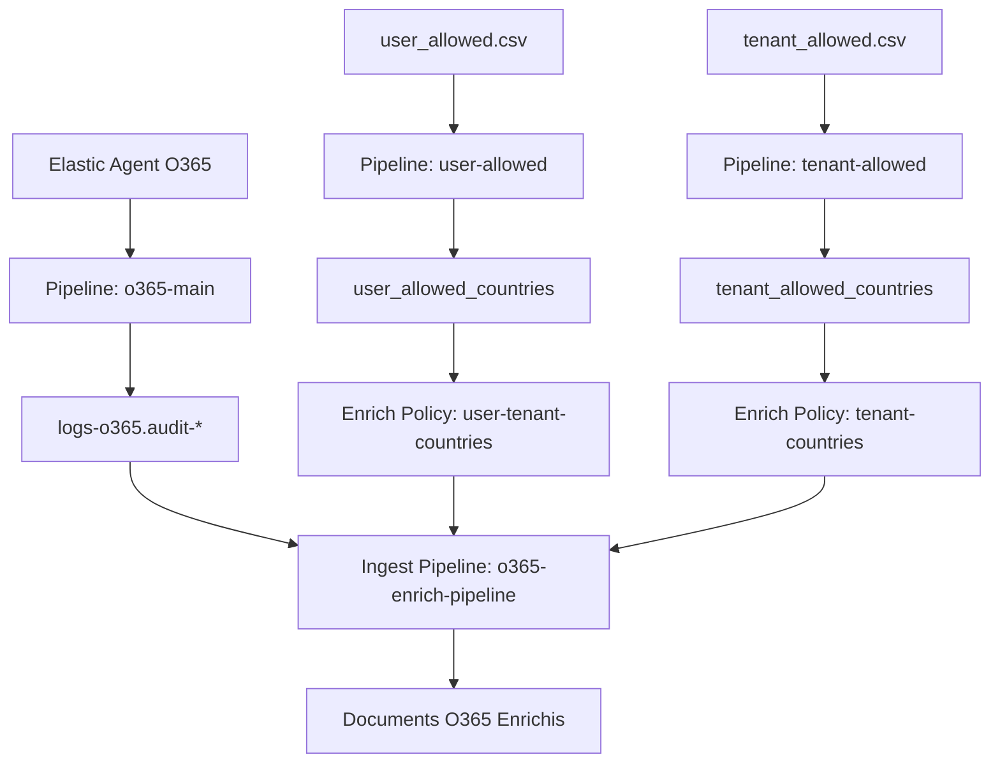

# Configuration Multi-Pipeline Logstash - Récapitulatif

## 🔧 Architecture des Pipelines Séparés

Basé sur la configuration dans `pipelines.yml`, nous avons **3 pipelines Logstash distincts** :

### 1. Pipeline `tenant-allowed`
```yaml
pipeline.id: tenant-allowed
path.config: "/etc/logstash/pipelines.d/tenant_allowed.conf"
pipeline.workers: 1
pipeline.batch.size: 100
pipeline.batch.delay: 100
```

**Fonction** : Import des listes blanches par tenant
- **Source** : `/var/data/csv/tenant_allowed.csv`
- **Destination** : Index `tenant_allowed_countries`
- **Document ID** : `%{tenant.id}`
- **Optimisation** : Configuration légère pour CSV

### 2. Pipeline `user-allowed`
```yaml
pipeline.id: user-allowed
path.config: "/etc/logstash/pipelines.d/user_allowed.conf"
pipeline.workers: 1
pipeline.batch.size: 100
pipeline.batch.delay: 100
```

**Fonction** : Import des listes blanches par utilisateur-tenant
- **Source** : `/var/data/csv/user_allowed.csv`
- **Destination** : Index `user_allowed_countries`
- **Document ID** : `%{tenant_user}` (clé composite)
- **Optimisation** : Configuration légère pour CSV

### 3. Pipeline `o365-main`
```yaml
pipeline.id: o365-main
path.config: "/etc/logstash/pipelines.d/o365-main.conf"
pipeline.workers: 4
pipeline.batch.size: 500
pipeline.batch.delay: 50
```

**Fonction** : Traitement principal des événements O365
- **Source** : Elastic Agent (Beats input)
- **Destination** : Data streams `logs-o365.audit-*`
- **Enrichissement** : GeoIP + préparation lookup
- **Optimisation** : Configuration haute performance

## 🔄 Flux de Données Corrigé



## ⚙️ Configuration Spécifique par Pipeline

### Pipeline CSV (tenant-allowed & user-allowed)
- **Workers** : 1 (traitement séquentiel des CSV)
- **Batch Size** : 100 (adapté aux fichiers CSV légers)
- **Batch Delay** : 100ms (pas de rush)
- **Auto-reload** : 30s (détection changements CSV)

### Pipeline O365 (o365-main)
- **Workers** : 4 (traitement parallèle haute performance)
- **Batch Size** : 500 (optimisé pour le débit)
- **Batch Delay** : 50ms (traitement rapide)
- **Auto-reload** : 10s (réactivité config)

## 🔍 Avantages de cette Séparation

### 1. **Isolation des Performances**
- Les CSV n'impactent pas le traitement O365 en temps réel
- Optimisation spécifique par type de données

### 2. **Gestion Indépendante**
- Redémarrage/maintenance d'un pipeline sans affecter les autres
- Configuration spécialisée par usage

### 3. **Évolutivité**
- Ajout facile de nouveaux types de sources
- Scaling horizontal par pipeline

### 4. **Monitoring Granulaire**
- Métriques séparées par pipeline
- Identification précise des problèmes

## 📊 Métriques de Surveillance

### Commandes de Vérification
```bash
# Status général des pipelines
curl -X GET "localhost:9600/_node/pipelines"

# Métriques pipeline tenant-allowed
curl -X GET "localhost:9600/_node/pipelines/tenant-allowed"

# Métriques pipeline user-allowed
curl -X GET "localhost:9600/_node/pipelines/user-allowed"

# Métriques pipeline o365-main
curl -X GET "localhost:9600/_node/pipelines/o365-main"
```

### Logs Spécifiques
```bash
# Surveiller les pipelines CSV
tail -f /var/log/logstash/logstash-plain.log | grep -E "(tenant-allowed|user-allowed)"

# Surveiller le pipeline principal
tail -f /var/log/logstash/logstash-plain.log | grep "o365-main"
```

## 🚀 Optimisations Recommandées

### Pour les Pipelines CSV
```yaml
# Ajout dans pipelines.yml
pipeline.ordered: false  # Pas besoin d'ordre pour CSV
queue.type: memory       # Queue en mémoire suffisante
```

### Pour le Pipeline O365
```yaml
# Ajout dans pipelines.yml
pipeline.ordered: true   # Maintenir l'ordre des événements
queue.type: persisted    # Queue persistante pour sécurité
queue.max_bytes: 1gb     # Buffer pour pics de trafic
```

## 🔧 Commandes de Gestion

### Démarrage Sélectif
```bash
# Démarrer seulement les pipelines CSV
logstash -f /etc/logstash/pipelines.d/tenant_allowed.conf,/etc/logstash/pipelines.d/user_allowed.conf

# Démarrer seulement le pipeline O365
logstash -f /etc/logstash/pipelines.d/o365-main.conf
```

### Rechargement Dynamique
```bash
# Recharger la configuration des pipelines
curl -X POST "localhost:9600/_node/pipelines/_reload"

# Recharger un pipeline spécifique
curl -X POST "localhost:9600/_node/pipelines/tenant-allowed/_reload"
```

Cette architecture multi-pipeline offre une **séparation claire des responsabilités** et une **optimisation spécifique** pour chaque type de données, tout en maintenant la flexibilité et les performances requises pour une solution SIEM O365 complète.
